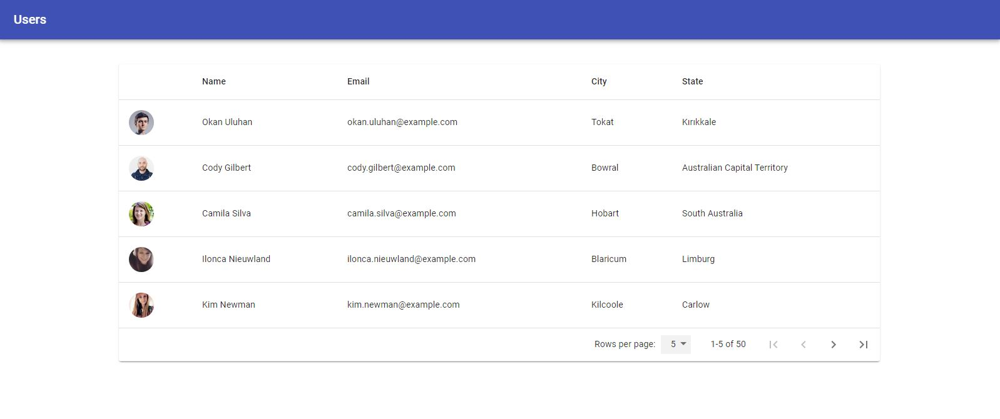

# Simplibuild React App
It is a demo application to display user listing. We have built it with React, Redux and Material UI libraries. This application is bootstrapped with `Create React App` which provide default support of ES6 standards. we generally use eslint with `Airbnb` standards in react development but not in this case.

## Available Scripts

In the project directory, you can run:

### `yarn install`

Run this command to install package dependencies 

### `yarn start`

Runs the app in the development mode. 
Open [http://localhost:3000](http://localhost:3000) to view it in the browser.

### `yarn build`

Builds the app for production to the `build` folder. 
It correctly bundles React in production mode and optimizes the build for the best performance.

The build is minified and the filenames include the hashes. 
Your app is ready to be deployed!

## Application Directory Structure
- `public` : Public directory to contain index.html template and assets
- `src`
  - `actions` : Contain all actions for the application
  - `components` : Contain all reusable components
  - `containers` : Contain all screen containers
    - `Home` : Home screen
  - `reducers` : Contain reducers used in application
  - `services` : Contain all api services
  - `store` : Store configuration
  - `App.js` : Root component
  - `index.js` : Entry point of the application
  - `serviceWorker.js` : Service worker
- `package.json` : Package manager

### Snapshot

